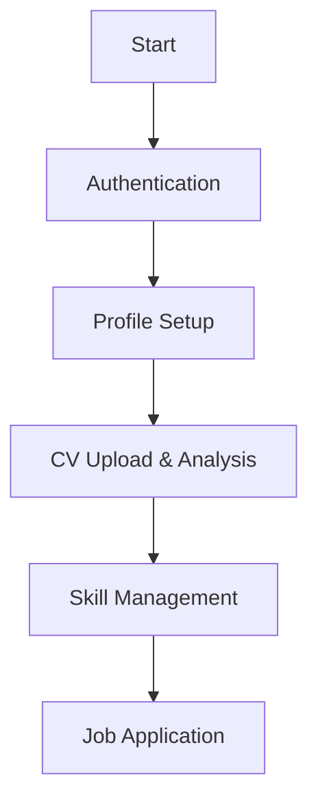

# Candidate Application Workflow Documentation

## Application Process Flow



## Core Components

### 1. Candidate Schema (Mongoose)
```typescript
{
  // ...other fields
  skills: {
    name: string;
    category: "TECHNICAL" | "INTERPERSONAL" | "LANGUAGE";
    proficiencyLevel: "Natif" | "Professionnel" | "Intermédiaire" | "Débutant";
    yearsOfExperience?: number;
  }[];
  applications: {
    jobId: Types.ObjectId;
    applicationDate: Date;
    status: "PENDING" | "REVIEWED" | "REJECTED";
  }[];
}
```

### 2. Application DTO (Data Transfer Object)
```typescript
class CreateApplicationDto {
  @ApiProperty()
  @IsMongoId()
  jobId: string;

  @ApiProperty()
  @IsOptional()
  @IsString()
  coverLetter?: string;
}
```

### 3. Typical Application Payload
```json
{
  "jobId": "507f1f77bcf86cd799439011",
  "coverLetter": "Experienced developer with 5+ years in Node.js...",
  "referralCode": "EMP-123"
}
```

## Error Handling

### Common Validation Errors
| Error Code | Scenario | Resolution |
|------------|----------|------------|
| 400 | Missing required skill proficiencyLevel | Ensure all skills include valid proficiency levels |
| 404 | Job ID not found | Verify job exists and ID is correct |
| 409 | Duplicate application | Check existing applications before submitting |

## Example Sequence

1. **Get Profile**  
   `GET /auth/candidate/profile`

2. **Upload CV**  
   `POST /auth/candidate/upload-cv`

3. **Add Required Skills**  
   ```json
   {
     "name": "TypeScript",
     "category": "TECHNICAL",
     "proficiencyLevel": "Intermédiaire"
   }
   ```

4. **Submit Application**  
   `POST /jobs/{jobId}/apply`